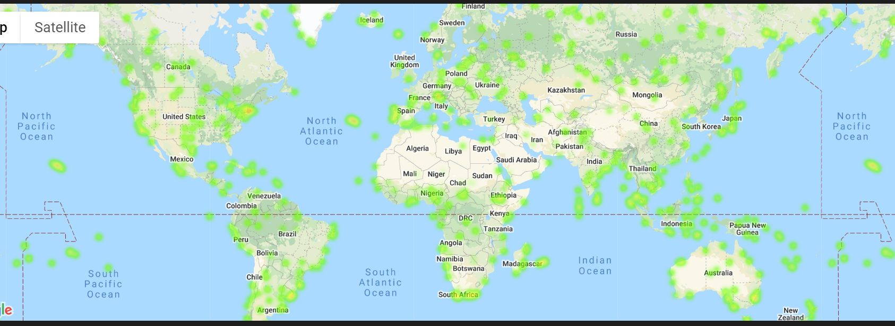
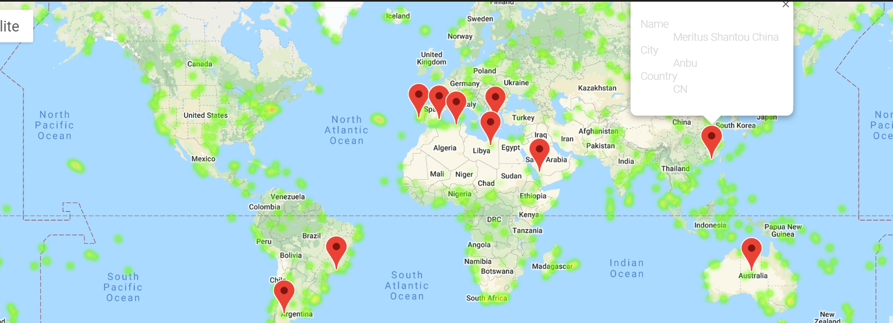

# Python API Challenge

## Overview

This repository holds functionality to collect weather data for randomized cities worldwide. The data is used to plot figures of weather based on latitude and to create a heatmap of humidity overlaid by markers of hotels near select cities.

## Plotting Weather Data

This section of the projects utilizes:
* the citipy API to find cities based on random latitudes and longitudes 
* the OpenWeatherMap API to get current weather data for each city

Plotting - these figures are plotted for all cities

* Temperature (F) vs. Latitude
* Humidity (%) vs. Latitude
* Cloudiness (%) vs. Latitude
* Wind Speed (mph) vs. Latitude

Plotting and Regression - These figures are plotted by hempisphere, and include regression line data and correlation data (r-value)

* Northern Hemisphere - Temperature (F) vs. Latitude

* Southern Hemisphere - Temperature (F) vs. Latitude

* Northern Hemisphere - Humidity (%) vs. Latitude

* Southern Hemisphere - Humidity (%) vs. Latitude

* Northern Hemisphere - Cloudiness (%) vs. Latitude

* Southern Hemisphere - Cloudiness (%) vs. Latitude

* Northern Hemisphere - Wind Speed (mph) vs. Latitude

* Southern Hemisphere - Wind Speed (mph) vs. Latitude

### Visualizing Global Data and Select Hotel Data

This section of the projects utilizes:
* the gmaps API to plot heatmaps and locations in jupyter notebooks
* the Google Places API to search for hotel locations in cities with optimal weather

Heat Map

* Creates a heat map that displays the humidity for every city from the part I

Find Hotels

* Narrows down the DataFrame to find ideal weather condition. Criteria:
  * A max temperature lower than 80 degrees but higher than 65.
  * Humidity less than 60%.
  * Cloudiness less than 30%.
  * Drop any rows that don't contain all three conditions

* finds the first hotel for each city located within 5000 meters of your coordinates.

* Plot the hotels on top of the humidity heatmap with each pin containing the Hotel Name, City, and Country.

